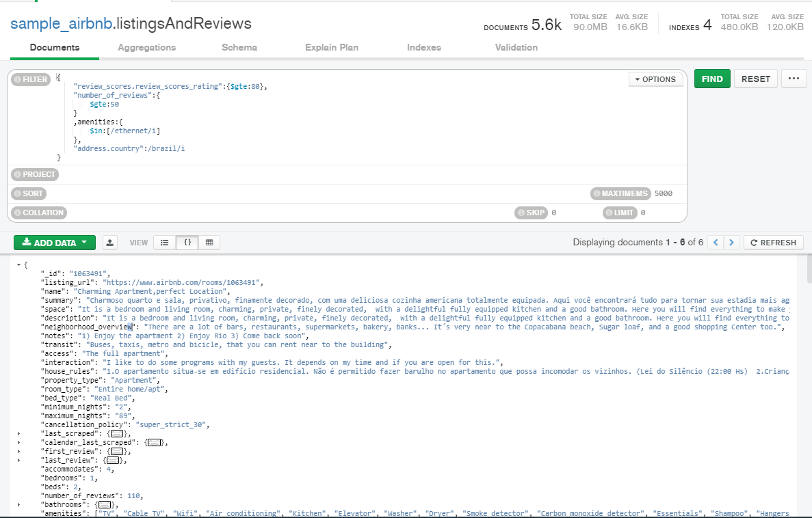

## Reto 1: Expresiones regulares


### Propiedades que no permitan fiestas.

```json
{
 filter: {
  house_rules: RegExp('NO parties', i)
 }
}

```


### Propiedades que admitan mascotas.

```json
{
 filter: {
  $and: [
   {
    house_rules: {
     $not: RegExp('can't accept pets', i)
    }
   },
   {
    $or: [
     {
      house_rules: RegExp('accept pets', i)
     },
     {
      house_rules: RegExp('pets allowed', i)
     }
    ]
   }
  ]
 },
 project: {
  name: 1,
  house_rules: 1
 }
}
```


### Propiedades que no permitan fumadores.

```json
{
 filter: {
  house_rules: {
   $in: [
    RegExp('NO smoke', i),
    RegExp('not smoke', i)
   ]
  }
 }
}
```


### Propiedades que no permitan fiestas ni fumadores.

```json
{
 filter: {
  $and: [
   {
    house_rules: {
     $in: [
      RegExp('no smoke', i),
      RegExp('not smoke')
     ]
    }
   },
   {
    house_rules: {
     $in: [
      RegExp('no parties', i),
      RegExp('not parties')
     ]
    }
   }
  ]
 }
}
```


## Reto 2: Notación punto y arreglos

```json
{
    "review_scores.review_scores_rating":{
        $gte:80
    },
    "number_of_reviews":{
        $gte:50
    }
    ,amenities:{
        $in:[/ethernet/i]
    },
    "address.country":/brazil/i
}
```



## Reto 3: Introducción a las agregaciones

```json
{amenities:
 	{
    $in:[/net/i,/wifi/i]
	}
}
```


